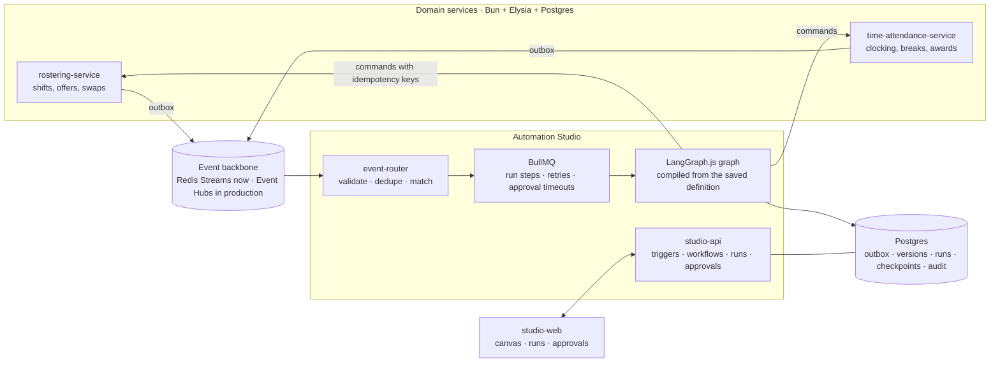

# WFM Automation Studio

A working slice of an agentic workflow platform for workforce management. Two domain services publish events. Customers compose workflows over those events on a drag-and-drop canvas. AI reasons, deterministic policy constrains, a human decides, and the domain service performs the write.

Built as a portfolio demo for a Senior Software Engineer (Automation & AI) role. It is inspired by the public Humanforce domain model and is not affiliated with Humanforce.

## What it demonstrates

- **Customer-authored automation.** Workflows are data, not code. The canvas saves a definition, the engine compiles it into an executable graph at run time, and runs pin the version they started with.
- **Platform invariants over user freedom.** The validator refuses a definition where a pay-affecting action is reachable without a policy check and a human approval on every path.
- **Human-in-the-loop that survives reality.** Approvals are measured in hours. The graph checkpoints into Postgres, so a restart does not lose a parked run, and a timeout escalates instead of auto-approving.
- **Engineering the failure paths.** Transactional outbox, at-least-once delivery with dedupe, retries with backoff, dead letters, and idempotent commands. Every one of these is exercised by a test.

## Architecture



## Quickstart

Prerequisites: Bun 1.3+, Docker.

```bash
bun install
bun run infra:up          # postgres + redis
bun run db:migrate        # one database per service
bun run seed              # demo tenant, staff, shifts, timesheet, workflows
bun run dev               # services, engine, worker, and the studio at :4104
```

Open http://127.0.0.1:4104.

To prove the whole thing without clicking, run:

```bash
scripts/verify.sh
```

That brings up infra, migrates, seeds, boots the four processes, runs the end-to-end scenarios, and exits non-zero if any property fails.

## The two demo scenarios

**Coverage rescue.** A sick call cancels a registered-nurse shift 7.5 hours before it starts. The engine resolves the shift, ranks eligible staff by qualification, rest rule, availability, and cost, checks policy, and parks the run for a roster manager. On approval it offers the shift with an idempotency key. A replayed approval cannot double-apply.

**Payroll-safe timesheet exception.** A nurse clocks out of an 8.25 hour shift without taking the unpaid break the award requires, and crosses into overtime. The engine reads the timesheet and the award rule, drafts the adjustment, computes the pay impact, and waits for People Ops. On approval the adjustment is applied and the audit row names the approver.

Both are driven by the services, not by a test hook. The simulator calls the same endpoints a real client would.

## Repo map

| Path | What it is |
|---|---|
| `docs/design.md` | The design brief. Domain model, event catalogue, run lifecycle, reliability model |
| `docs/adr/` | Nine decisions with their trade-offs |
| `docs/jd-mapping.md` | Each requirement from the job description mapped to the artifact that answers it |
| `packages/contracts` | Event envelope, event registry, API DTOs, actor context, condition DSL |
| `packages/workflows` | Workflow DSL, catalogues, validator, compiler, demo templates |
| `packages/eventbus` | Backbone port, Redis Streams binding, in-memory binding for tests |
| `packages/outbox` | Transactional outbox with a publisher that claims rows safely |
| `services/rostering-service` | Shifts, candidates, offers, swaps |
| `services/time-attendance-service` | Clocking, breaks, timesheets, award maths, exceptions |
| `services/studio-api` | Engine: router, orchestrator, node executors, approvals, workflow CRUD |
| `apps/studio-web` | Next.js studio: canvas, triggers, runs, approvals |
| `tests/e2e` | The two scenarios plus idempotency and authorisation checks |

## How it is built

- **Runtime and types.** Bun, strict TypeScript, no `any`, external data parsed at boundaries with zod. The UI imports the server's route types through Elysia's Eden treaty.
- **Data.** Postgres with Drizzle ORM, one database per service. A domain write and its outbox rows share a transaction, which is what makes at-least-once publication safe.
- **Events.** One envelope shape everywhere, versioned, tenant-partitioned, carrying correlation, causation, and trace context. Payloads carry identity, not truth, so consumers re-read current state. This mirrors the skinny webhooks Humanforce HR already emits.
- **Execution.** BullMQ owns retries, backoff, delayed approval timeouts, and concurrency. LangGraph owns the graph and the interrupt. Our orchestrator owns the run record, the audit, and the timeline.
- **AI.** Optional. An LLM proposer and a deterministic rules proposer sit behind one interface and produce the same structure with evidence. CI never calls a model.

## Testing

```bash
bun test packages        # contracts, DSL, validator, compiler, templates
bun test services        # award maths, ranking, idempotency, routing, approvals
bun test tests/e2e       # both scenarios against the running stack
bun run typecheck
```

The end-to-end suite asserts observable state only: run rows, approval records, timeline events, and the domain services' own API responses.

## Production mapping

| Demo | Production |
|---|---|
| Redis Streams consumer groups | Azure Event Hubs consumer groups, same envelope, same port |
| BullMQ on local Redis | BullMQ on Azure Cache for Redis |
| Postgres checkpointer, one node | Postgres Flexible Server, checkpointer tables partitioned by tenant |
| Actor headers | Entra ID plus tenant-scoped RBAC |
| Secrets in `.env` | Key Vault with managed identity |
| pino to stdout | OTel SDK to Azure Monitor, same traceparent chain |

## What is deliberately missing

No knowledge or retrieval service, no Entra ID, no Azure deployment, no row-level security, no multi-region work. Each is named with its reason in `docs/jd-mapping.md`.
