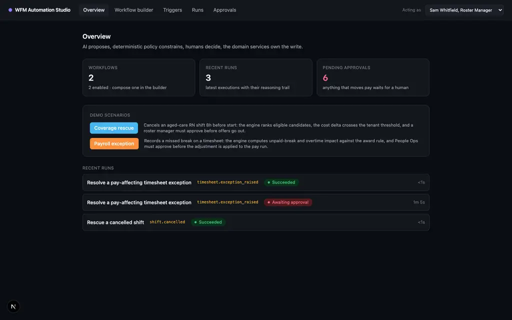
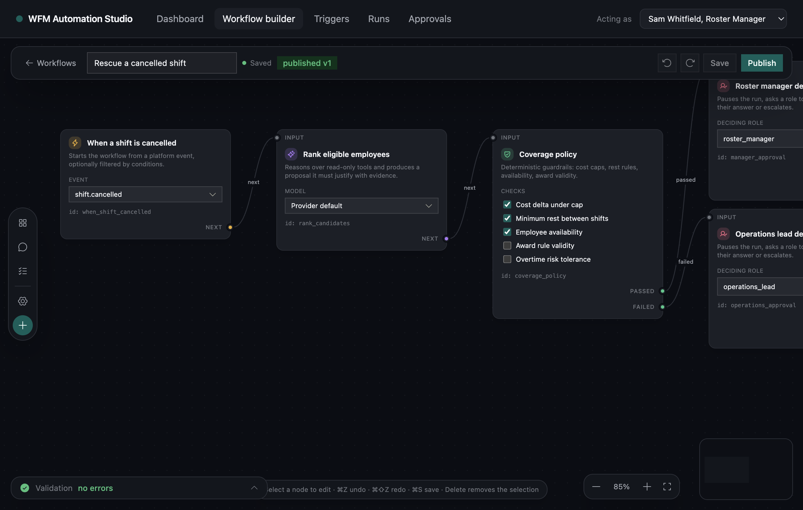
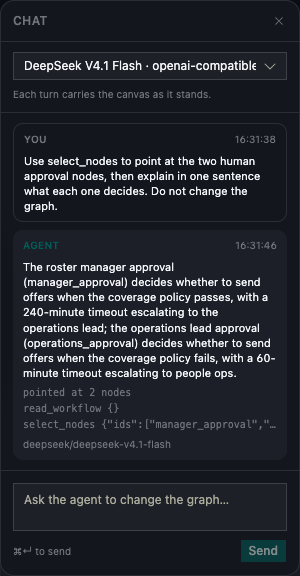
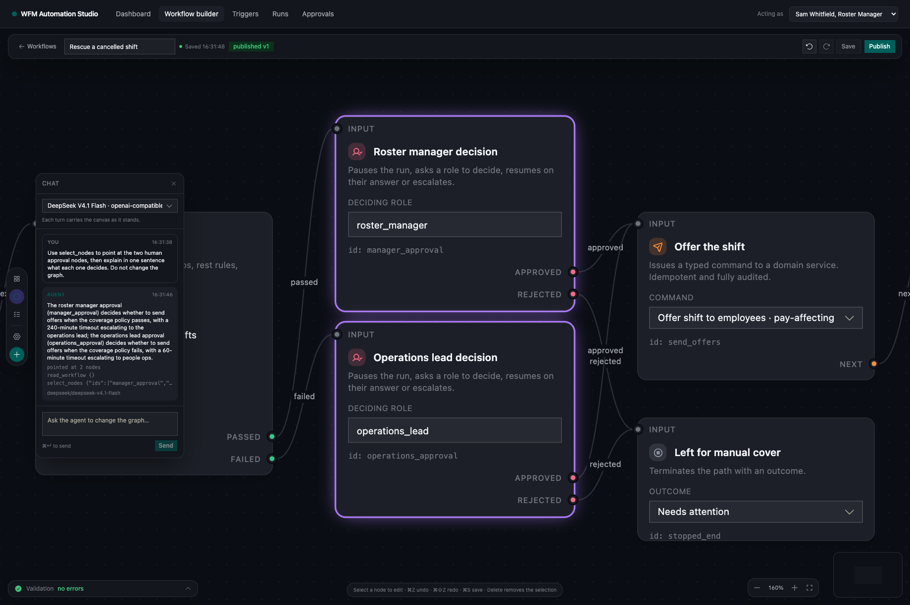
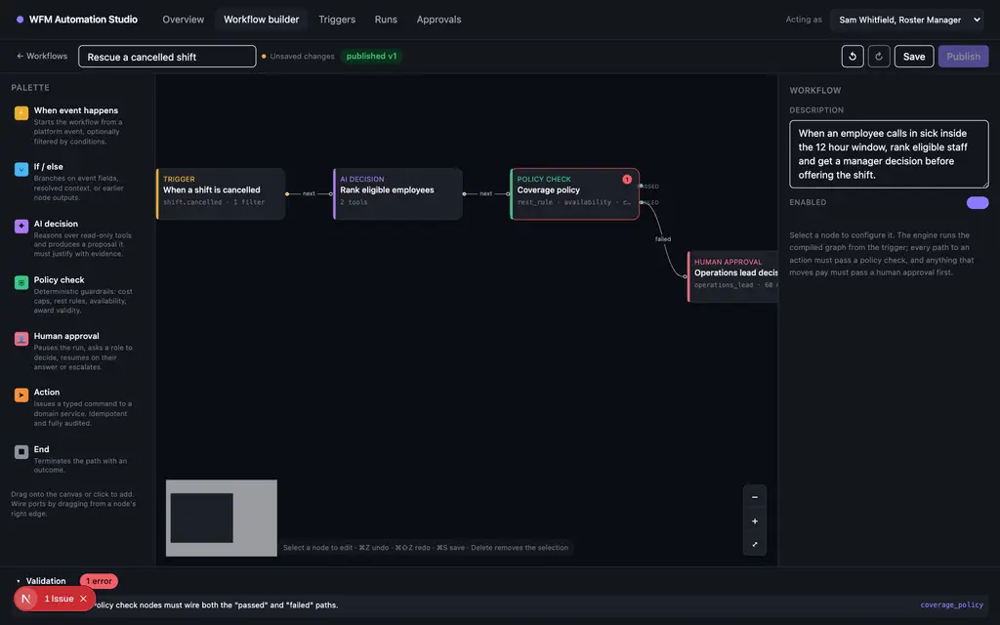
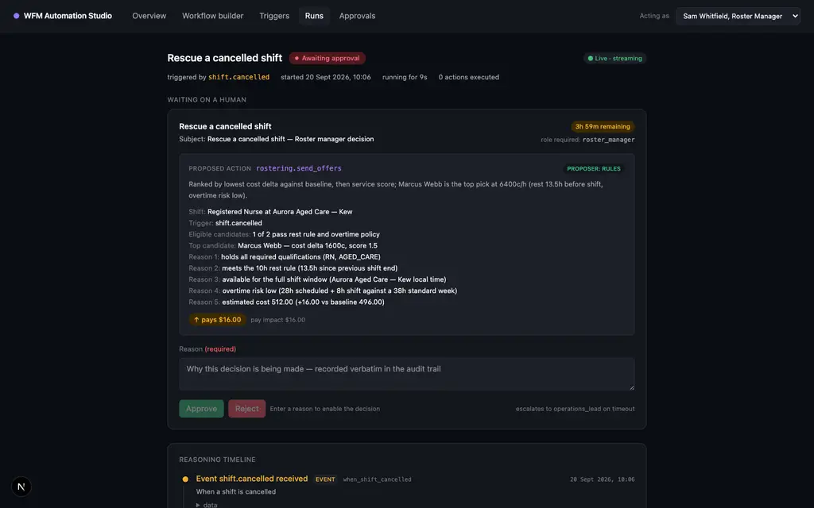
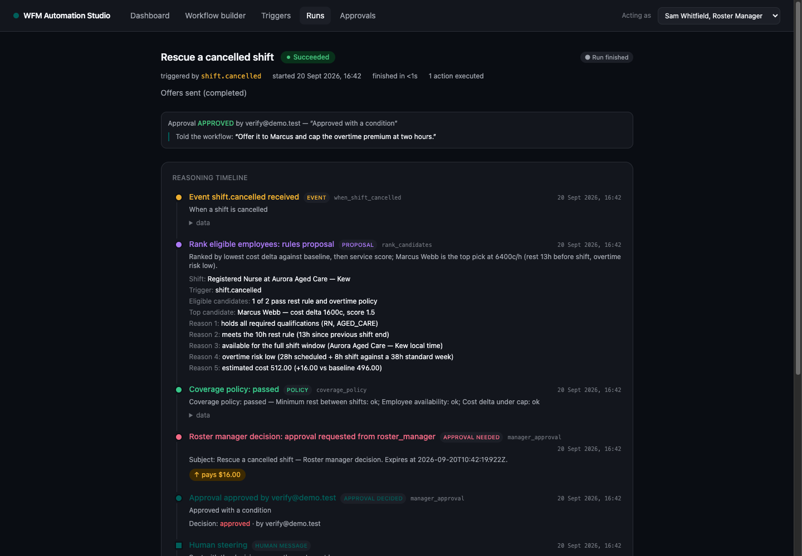
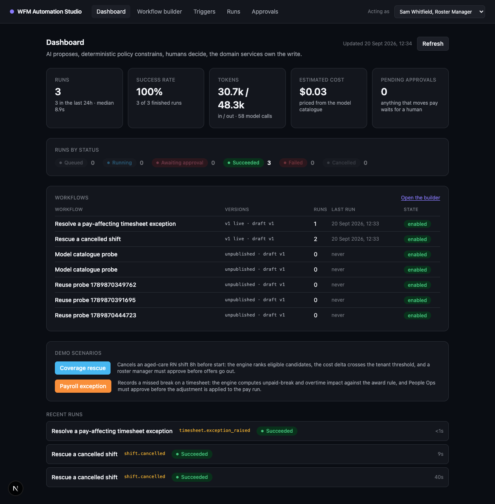
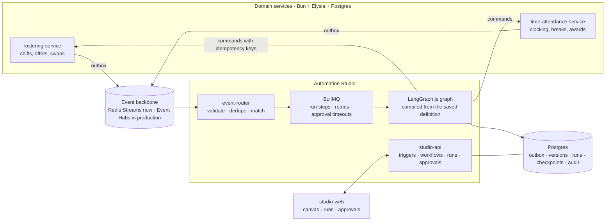

# WFM Automation Studio

A working slice of an agentic workflow platform for workforce management. Two domain services publish events. Customers compose workflows over those events on a drag-and-drop canvas. AI reasons, deterministic policy constrains, a human decides, and the domain service performs the write.

Built as a portfolio demo for a Senior Software Engineer (Automation & AI) role. It is inspired by the public Humanforce domain model and is not affiliated with Humanforce.

## Verified, not asserted

```
scripts/verify.sh
  1. Infrastructure        PASS postgres and redis are healthy
  2. Migrations            PASS migrations applied
  3. Seed                  PASS demo data seeded
  4. Typecheck             PASS workspace typechecks
  5. Services              PASS rostering-service is up
                           PASS time-attendance-service is up
                           PASS studio-api is up
  6. End-to-end scenarios  PASS coverage rescue, payroll exception, idempotency, role checks
  Result                   all properties verified
```

162 tests across 25 files (`bun test packages services`), including one that throws an engine away mid-approval and finishes the run on a second instance, plus 8 end-to-end scenarios against the running stack.

Feature-level proof, on top of the above:

```
scripts/verify-features.sh
  1. Platform provider     PASS provider: the platform provider runs the workflow
  2. Bring your own        PASS provider: a customer-supplied provider is used
  3. Rules fallback        PASS provider: no provider configured falls back to the rules proposer
  4. Model catalogue       PASS models: every offered model is declared in config/models.jsonl
                           PASS models: a workflow naming an unknown model is rejected at save time
  5. Token accounting      PASS tokens: run detail reports the provider usage
                           PASS tokens: dashboard totals match the run detail
  6. Dashboard             PASS dashboard: run counts match SQL aggregates
  7. Run input and output  PASS run detail: the trigger payload is exposed as input
                           PASS run detail: the delivered result is exposed as output
  8. Workflow reuse        PASS reuse: a new workflow can be created from an existing one
  9. References, artifacts PASS references: a run resolves {{input.payload.*}} and context paths
 10. Node-kind extension   PASS extension: a new node kind is one file plus registration lines
 11. Domain outcome        PASS outcome: the domain service reflects the workflow action
 12. Steering             PASS steering: an approver message reaches the run and its artifacts
 13. Builder chat          PASS builder: a chat turn edits the graph through validated operations
  Result                   all 20 feature properties verified
```

Step 12 approves a coverage run with a sentence the reviewer typed, then reads the artifact back and
checks the approver's words are in it verbatim. Step 13 puts a real model behind the builder chat,
asks for a change, and asserts the returned definition has the node it added, wired, with no
validation errors. Both are checked against the running stack, not against a mock.

Every provider check runs against the real vendor configured in `.env`. The run detail's token
totals are compared against the `llm_calls` rows, not against a number the engine computed twice. The UI was exercised in a real browser, not just built: the canvas renders the compiled graph, deleting the approval node disables Publish with the offending node named, the approval card shows the rationale, evidence and pay impact, and approving resumes the run to `succeeded` with the shift moving to `offered`.

| | |
|---|---|
|  |  |
|  |  |
|  |  |
|  |  |

## What it demonstrates

- **Customer-authored automation.** Workflows are data, not code. The canvas saves a definition, the engine compiles it into an executable graph at run time, and runs pin the version they started with.
- **Platform invariants over user freedom.** The validator refuses a definition where a pay-affecting action is reachable without a policy check and a human approval on every path.
- **Human-in-the-loop that survives reality.** Approvals are measured in hours. The graph checkpoints into Postgres, so a restart does not lose a parked run, and a timeout escalates instead of auto-approving.
- **Engineering the failure paths.** Transactional outbox, at-least-once delivery with dedupe, retries with backoff, dead letters, and idempotent commands. Every one of these is exercised by a test.
- **Bring your own model.** A tenant picks the platform's endpoint, their own OpenAI-compatible base URL, or Anthropic, with a key stored encrypted and never read back. Only models declared in `config/models.jsonl` are offered, and a workflow naming anything else is refused at save time.
- **Cost you can check.** Every call records the vendor's own token counts, so the run detail, the run list, and the dashboard all show the same numbers, priced from the catalogue.
- **Data in the builder.** The canvas lists the trigger event's fields with sample values and inserts `{{...}}` references into prompts, action inputs, and artifact bodies. References are validated at save time against the event's published schema.
- **Artifacts.** A run can render a document from its own data and attach it, which is what the run detail shows as its delivered output.
- **Extension by declaration.** A node kind is one file plus registration lines: its config schema, ports, capabilities, canvas fields, summary, and template slots in one place. The validator's platform invariants are written against capabilities, so a new kind inherits pay-safety rules without new validator code.
- **Steering, not just approving.** A decision carries three things: the decision routes the graph, the reason goes to the audit trail, and the feedback becomes the next human message in the run. Downstream AI nodes decide with the approver's instruction in front of them, and `{{run.feedback}}` lets an artifact quote it. Steering is advice, never authority: it changes what a model prefers, not what a policy check permits.
- **A workflow you can describe.** The builder has a chat panel beside the canvas, and the agent behind it works the way an engineer would: it has tools to read the graph, read the node-kind catalogue with each kind's legal configuration, read the trigger's data, add, update, move, connect and disconnect nodes, and point the canvas at what it means. It is a Deep Agents harness with a real tool loop, so a turn that adds a node reads the graph back to check its own work before answering. The model still does not write a definition: the write tools collect operations from a closed set, and one applier validates them against the same kind declarations the canvas uses. A bad call is refused with the legal alternatives named, an unfinished graph is reported as not valid yet, and the client sends its current graph every turn, so the agent reasons about what is on screen, including nodes you dragged.
- **An agent whose work you can see.** Every turn leaves a trail under its reply: the tool calls it made with their arguments, and a line saying what it pointed at. When a turn asks the canvas to point at nodes, the canvas frames them and rings them without selecting them, so the inspector stays shut and your next click takes the canvas back. Past four tool calls the trail collapses to a count, because a fourteen-call turn would otherwise push its own answer off the panel.
- **A conversation that stays inside its budget.** The turn above made 14 model calls and cost 137k input tokens, most of them tool results the agent had already read. The agent summarizes its own history once the conversation passes a token threshold and keeps the recent exchanges, so the twelfth turn does not pay for the first. Summary calls are ordinary model calls: they land in the same accounting table as everything else.
- **A builder that gets out of the way.** The graph owns the screen. The component list, the agent conversation, the node inspector, the validation log, and the zoom control all float over it, and the components panel is closed until you ask for it. Each node card carries its kind's icon, name, one-line purpose, the fields that matter for that kind editable in place, and one labelled row per port with the handle on the card's edge.

## Architecture



## Quickstart

Prerequisites: Bun 1.3+, Docker.

```bash
bun install
bun run infra:up          # postgres + redis
bun run db:migrate        # one database per service
bun run seed              # demo tenant, staff, shifts, timesheet, workflows
bun run dev               # services, engine, worker, and the studio at :4104
```

The platform provider reads `PLATFORM_LLM_BASE_URL`, `PLATFORM_LLM_API_KEY`, and `PLATFORM_LLM_MODEL`
from `.env`; `LLM_CONFIG_SECRET` encrypts any customer-supplied key; `config/models.jsonl` is the
allow-list of models the studio offers.

Open http://127.0.0.1:4104.

To prove the whole thing without clicking, run:

```bash
scripts/verify.sh            # infra, migrations, seed, typecheck, services, scenarios
scripts/verify-features.sh   # provider, catalogue, tokens, dashboard, reuse, artifacts, extension
```

`verify.sh` brings up infra, migrates, seeds, boots the four processes, runs the end-to-end
scenarios, and exits non-zero if any property fails. `verify-features.sh` assumes the stack is up and
checks the feature set above against it.

## The two demo scenarios

**Coverage rescue.** A sick call cancels a registered-nurse shift 7.5 hours before it starts. The engine resolves the shift, ranks eligible staff by qualification, rest rule, availability, and cost, checks policy, and parks the run for a roster manager. On approval it offers the shift with an idempotency key. A replayed approval cannot double-apply.

**Payroll-safe timesheet exception.** A nurse clocks out of an 8.25 hour shift without taking the unpaid break the award requires, and crosses into overtime. The engine reads the timesheet and the award rule, drafts the adjustment, computes the pay impact, and waits for People Ops. On approval the adjustment is applied and the audit row names the approver.

Both are driven by the services, not by a test hook. The simulator calls the same endpoints a real client would.

## Repo map

| Path | What it is |
|---|---|
| `docs/design.md` | The design brief. Domain model, event catalogue, run lifecycle, reliability model |
| `docs/adr/` | Fourteen decisions with their trade-offs |
| `docs/jd-mapping.md` | Each requirement from the job description mapped to the artifact that answers it |
| `packages/contracts` | Event envelope, event registry, API DTOs, actor context, condition DSL |
| `packages/workflows` | Node-kind registry, reference grammar and resolver, validator, compiler, demo templates |
| `packages/eventbus` | Backbone port, Redis Streams binding, in-memory binding for tests |
| `packages/outbox` | Transactional outbox with a publisher that claims rows safely |
| `services/rostering-service` | Shifts, candidates, offers, swaps |
| `services/time-attendance-service` | Clocking, breaks, timesheets, award maths, exceptions |
| `services/studio-api` | Engine: router, orchestrator, node executors, approvals, workflow CRUD, model providers, artifacts, dashboard |
| `config/models.jsonl` | The models the studio offers, one per line, with prices |
| `apps/studio-web` | Next.js studio: dashboard, canvas, triggers, runs, approvals, provider settings |
| `tests/e2e` | The two scenarios plus idempotency and authorisation checks |

## How it is built

- **Runtime and types.** Bun, strict TypeScript, no `any`, external data parsed at boundaries with zod. The runtime's own clients are preferred over npm drivers where it has them, which is a deliberate trade: the code is Bun-specific rather than portable to Node. The UI imports the server's route types through Elysia's Eden treaty.
- **Data.** Postgres with Drizzle ORM over Bun's built-in SQL client, one database per service. A domain write and its outbox rows share a transaction, which is what makes at-least-once publication safe.
- **Events.** One envelope shape everywhere, versioned, tenant-partitioned, carrying correlation, causation, and trace context. Payloads carry identity, not truth, so consumers re-read current state. This mirrors the skinny webhooks Humanforce HR already emits. The Redis Streams binding runs on Bun's own Redis client, so our packages carry no Redis driver; BullMQ brings its own, which is a property of that library rather than a choice here.
- **Execution.** BullMQ owns retries, backoff, delayed approval timeouts, and concurrency. LangGraph owns the graph and the interrupt. Our orchestrator owns the run record, the audit, and the timeline.
- **AI.** Optional and pluggable. `LlmProvider` is an abstract class over raw HTTP with two implementations (OpenAI-compatible, Anthropic); the deterministic rules proposer is the fallback whenever a tenant has no provider. Whichever ran, policy and human authority stay in the path, and the run records which model produced the proposal.

## Testing

```bash
bun test packages        # contracts, node kinds, references, validator, compiler, templates
bun test services        # award maths, ranking, idempotency, routing, approvals, providers, dashboard
bun test tests/e2e       # both scenarios against the running stack
bun run typecheck
```

The end-to-end scenarios call the configured model, so a reasoning model makes them slow. Point
`PLATFORM_LLM_MODEL` at `deepseek/deepseek-chat-v3.1` for a fast run, or set a tenant to `none` to
exercise the rules proposer.

The end-to-end suite asserts observable state only: run rows, approval records, timeline events, and the domain services' own API responses.

## Production mapping

| Demo | Production |
|---|---|
| Redis Streams consumer groups | Azure Event Hubs consumer groups, same envelope, same port |
| BullMQ on local Redis | BullMQ on Azure Cache for Redis |
| Postgres checkpointer, one node | Postgres Flexible Server, checkpointer tables partitioned by tenant |
| Actor headers | Entra ID plus tenant-scoped RBAC |
| Secrets in `.env` | Key Vault with managed identity |
| pino to stdout | OTel SDK to Azure Monitor, same traceparent chain |

## What is deliberately missing

No knowledge or retrieval service, no Entra ID, no Azure deployment, no row-level security, no multi-region work. Each is named with its reason in `docs/jd-mapping.md`.
