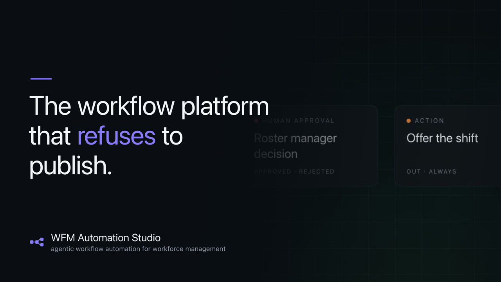
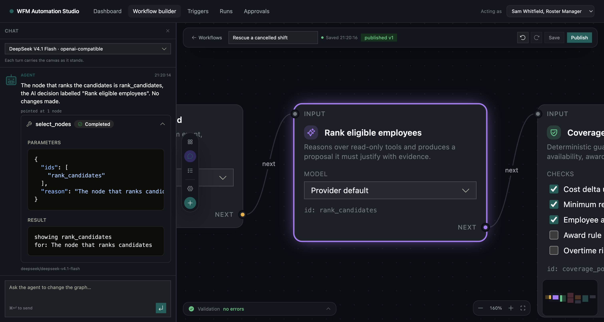
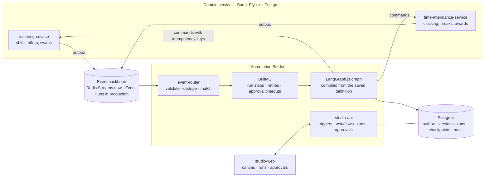

# WFM Automation Studio

A working slice of an agentic workflow platform for workforce management. Two domain services publish
events. Customers compose workflows over those events on a drag-and-drop canvas. AI reasons,
deterministic policy constrains, a human decides, and the domain service performs the write.

Built as a portfolio demo for a Senior Software Engineer (Automation & AI) role. Inspired by the
public Humanforce domain model, and not affiliated with Humanforce.

<a href="https://youtu.be/ds2eEZ2Bl2g"></a>

**[Watch the 25-second demo](https://youtu.be/ds2eEZ2Bl2g)**: the canvas assembling, the agent
building a workflow through the chat, and the validator refusing to publish one that moves pay
without a human in the path. [Or download the mp4](docs/brag.mp4).

| | |
|---|---|
| `scripts/verify.sh` | infra, migrations, seed, typecheck, four services, 8 end-to-end scenarios. **All properties verified.** |
| `scripts/verify-features.sh` | 22 feature properties against the real provider. **All verified.** |
| `bun run test` | 190 tests across 28 files. |

Those checks run against the running stack and a real model vendor, not a mock. An approver's typed
sentence is read back out of the artifact it produced; a chat turn is asserted to have added and
wired a node with no validation errors; an agent node's tool trail and its one accounting row are
read from the database. **[What each one proves](docs/verification.md)**.

| | |
|---|---|
|  |  |
|  |  |

## What it demonstrates

- **Workflows are data, not code.** The canvas saves a definition, the engine compiles it into an executable graph at run time, and a run pins the version it started with.
- **Platform invariants over user freedom.** The validator refuses a definition where a pay-affecting action is reachable without a policy check and a human approval on every path.
- **Human-in-the-loop that survives reality.** Approvals are measured in hours, the graph checkpoints into Postgres, a restart does not lose a parked run, and a timeout escalates instead of auto-approving.
- **Two AI nodes, one decision.** `ai_decision` makes exactly one model call, so its cost and prompt are derivable from the saved definition. `agent` is the loop, with a step budget and a recorded trail. Both return the same structured proposal and pass the same gates.
- **A workflow you can describe, and watch it work.** The chat edits the graph through validated operations, never by writing a definition, and streams its prose and its tool calls while it works.
- **Steering, not just approving.** A decision carries three things: the decision routes the graph, the reason goes to the audit trail, and the feedback becomes the next human message in the run. It changes what a model prefers, never what a policy check permits.
- **Bring your own model.** Platform endpoint, the customer's own OpenAI-compatible base URL, or Anthropic, with the key stored encrypted and never read back. Only models declared in the catalogue are offered.
- **Cost you can check.** Every call records the vendor's own token counts, so the run detail, the run list and the dashboard show the same numbers, priced from the catalogue.
- **Extension by declaration.** A node kind is one file plus registration lines. The validator's invariants are written against capabilities, so a new kind inherits pay-safety rules without new validator code.
- **Engineering the failure paths.** Transactional outbox, at-least-once delivery with dedupe, retries with backoff, dead letters, idempotent commands. Each is exercised by a test.

## Stack

| Layer | Choice | Why this one |
|---|---|---|
| Runtime | **Bun** | One binary runs the services, the package manager, the test runner and the bundler, and it ships its own SQL and Redis clients, so the tree carries fewer drivers. |
| HTTP | **Elysia** | Routes declare their schemas once, which gives validation at the edge and a typed client for free: the browser imports the server's route types through Eden instead of a hand-written API layer. |
| UI | **Next.js** | The canvas is a stateful client tree inside a server-rendered shell, and the App Router supplies routing, fonts and bundling without a second build pipeline. |
| Canvas | **React Flow** | Nodes, ports, edges, selection and viewport maths are the entire problem on that screen. |
| Queue | **BullMQ** | Retries with exponential backoff, delayed jobs and concurrency out of the box, which is exactly what run execution and approval timeouts need. |
| Database | **Postgres** | One transactional store per service, so a domain write and its outbox rows commit together, with JSONB for the graph and the tables the LangGraph checkpointer needs. |
| Bus | **Redis** | Redis Streams with consumer groups gives at-least-once delivery and a dead-letter path locally, behind a port Azure Event Hubs satisfies in production. |
| Graph | **LangGraph.js** | A compiled state machine with a real interrupt, so a run can park on an approval for hours and resume from a checkpoint instead of holding a process open. |
| Model | **LangChain + Deep Agents** | The builder agent needs a tool loop with middleware; the adapter underneath is ours, so no vendor SDK reaches the domain. |

## Architecture



## Quickstart

Prerequisites: Bun 1.3+, Docker.

```bash
bun install
bun run infra:up          # postgres + redis
bun run db:migrate        # one database per service
bun run seed              # demo tenant, staff, shifts, timesheet, workflows
bun run dev               # services, engine, worker, and the studio at :4104
```

The platform provider reads `PLATFORM_LLM_BASE_URL`, `PLATFORM_LLM_API_KEY` and `PLATFORM_LLM_MODEL`
from `.env`; `LLM_CONFIG_SECRET` encrypts any customer-supplied key; `config/models.jsonl` is the
allow-list of models the studio offers.

Open <http://127.0.0.1:4104> and fire one of the two demo scenarios from the dashboard: a cancelled
shift needs cover, or a clock-out with no break taken raises a pay-affecting exception. Both run the
real domain services, and both park on a human before anything moves pay.

To prove the whole thing without clicking:

```bash
scripts/verify.sh            # infra, migrations, seed, typecheck, services, scenarios
scripts/verify-features.sh   # provider, catalogue, tokens, dashboard, reuse, artifacts, extension
```

## Where to start reading

| | |
|---|---|
| **[docs/design.md](docs/design.md)** | The design: the event contract, the DSL, the platform invariants, the engine, the provider boundary, the builder. 13 sections, and the reasoning behind each. |
| **[docs/adr/](docs/adr/)** | Fifteen decisions with their context and what each cost, including the alternatives that were rejected. |
| **[packages/workflows/src/kinds/](packages/workflows/src/kinds/)** | The extension claim, in eight small files. One is enough to see how a node kind declares itself. |
| **[services/studio-api/src/engine/nodes/](services/studio-api/src/engine/nodes/)** | How a node executes, including the policy evaluator and the two AI nodes. |
| **[apps/studio-web/components/builder/canvas.tsx](apps/studio-web/components/builder/canvas.tsx)** | The canvas: React Flow state, the DSL derived on save, undo, autosave, and the focus ring. |
| **[decisions.tsv](decisions.tsv)** | The running decision log, one row per call made along the way. |

## Documentation

| Doc | What is in it |
|---|---|
| [docs/design.md](docs/design.md) | The design brief, including the [non-goals](docs/design.md#2-non-goals), the [testing strategy](docs/design.md#10-testing-strategy), the [production mapping](docs/design.md#11-production-mapping-what-changes-what-doesnt) and the [known trade-offs](docs/design.md#13-known-trade-offs) |
| [docs/verification.md](docs/verification.md) | What each check proves, and the traps in running them |
| [docs/adr/](docs/adr/) | Fifteen architecture decisions |
| [docs/jd-mapping.md](docs/jd-mapping.md) | Each job-description line mapped to the artifact that answers it |
| [docs/demo-script.md](docs/demo-script.md) | The recording script: beats, the prompts to paste, expected results, timings |
| [docs/loom-script.md](docs/loom-script.md) | The short screen-recording script |
| [AGENTS.md](AGENTS.md) | How to work in this repo: house rules, the ripwire workflow, the traps |
| [decisions.tsv](decisions.tsv) | The decision log |

## Repo map

| Path | What it is |
|---|---|
| `packages/` | contracts, workflows (DSL, kinds, validator, compiler), eventbus, outbox, observability, testkit |
| `services/` | rostering-service, time-attendance-service, studio-api (engine, builder, providers) |
| `apps/studio-web/` | The studio: dashboard, canvas, chat, triggers, runs, approvals, settings |
| `tests/e2e/` | The two scenarios, plus idempotency and authorisation checks |
| `scripts/` | seed, dev, verify, verify-features |

## What this is not

No knowledge or retrieval service, no Entra ID, no Azure deployment, no row-level security, no
multi-region work, and demo-grade authentication. Each is named with its reason in
[docs/jd-mapping.md](docs/jd-mapping.md), and the non-goals are argued in
[docs/design.md](docs/design.md#2-non-goals).
