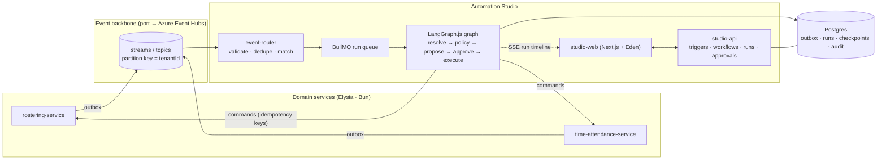

# WFM Automation Studio — design brief

**Status:** accepted for implementation · **Owner:** Chandra Teja Doredla · **Audience:** Humanforce engineering (Automation & AI team)

## 1. Why this exists

Humanforce runs a large estate of workforce-management microservices (rostering, time & attendance,
awards, payroll, HR, talent). Those services emit state changes — a shift is cancelled, a break is
missed, a timesheet crosses into overtime — and those changes are the raw material for the
*Automation & AI* platform: a place where customers compose their own workflows over platform events,
with AI doing the reasoning and humans keeping the authority over anything that touches pay,
compliance, or a person's roster.

This repository is a working slice of that platform, built end to end:

1. Two user-facing domain services modelled on real Humanforce surfaces (rostering; time &
   attendance with award compliance), each publishing domain events through a transactional outbox.
2. An event backbone (port + adapters; Azure Event Hubs in production).
3. **Automation Studio** — a trigger catalogue, a durable run orchestrator, a LangGraph.js agent graph
   with human-in-the-loop interrupts and resumption, approvals, audit, and evaluation hooks.
4. A Next.js studio UI where a customer sees triggers, composes a workflow, watches a run's reasoning
   trail, and approves or rejects the step that needs a human.

The point of the shape is the boundary: **AI proposes, deterministic policy constrains, humans decide,
the domain services own the write.** Nothing in the agent path can mutate pay or a roster directly.

## 2. Non-goals

- Not a Humanforce product, integration, or a claim of affiliation. Domain names, event names, and
  record shapes mirror their public API surface so the demo reads as a real fit.
- No real customer data, no real payroll, no production Azure deployment in this repo.
- Not an auth product: demo-safe actor headers stand in for OIDC + tenant-scoped RBAC (see ADR-0008).

## 3. Grounding in the real product surface

| Humanforce reality (verified) | Where it shows up here |
|---|---|
| WFM REST API resources: `rosterItems`, `shiftTypes`, `timesheets`, `timesheetBreaks`, `clocking/clockin|clockout`, `awardprofiles`, `payRuns`, `availability`, `employees/qualifications` | Domain model of the two services |
| HR suite already emits **skinny webhooks** per tenant (`{id, event, timestamp, links:{self}}`, slugs like `person.created`, `job.update_scheduled`, `user.disabled_upcoming`) | Event envelope keeps identity, not truth: payload carries ids + facts that are true at emit time, and the engine fetches current state |
| WFM REST API exposes **no** event surface (pull-only) | The gap this platform fills; services gain an outbox + event publication |
| Humanforce Connect: "post once, route automatically", internal-fill-first then marketplace/agency | Coverage-rescue workflow cascade |
| Award compliance & payroll-ready timesheets marketing (120+ awards, "100% payrun-ready") | Payroll-safe exception workflow and its guardrails |
| SOC 2 / ISO 27001 posture, multi-tenant SaaS | Tenant scoping on every row, event, run, and approval; append-only audit |

## 4. System context



## 5. Domain services

### 5.1 `rostering-service` (port 4101)

Owns shifts, roster publication, shift offers, and swap requests. Mirrors WFM `rosterItems` +
`shiftTypes` + the `HF Work App` self-service flows (offers, swaps, requests).

Emits: `shift.published`, `shift.unfilled`, `shift.cancelled`, `shift.swap_requested`,
`shift.offers_sent`, `shift.assigned`.

Exposes (used by the engine and the simulator):

| Method | Path | Purpose |
|---|---|---|
| GET | `/shifts/:shiftId` | Shift detail incl. required qualifications |
| GET | `/shifts/:shiftId/candidates` | Ranked eligible employees with per-candidate compliance notes and cost estimate |
| POST | `/shifts/:shiftId/offers` | Offer the shift to an employee list (`Idempotency-Key` required) |
| POST | `/shifts/:shiftId/assignment` | Direct assignment after approval (`Idempotency-Key` required) |
| POST | `/shifts/:shiftId/cancellation` | Employee or manager cancels a shift (simulator + real path) |
| POST | `/shifts/:shiftId/acceptance` | Employee accepts an offer — closes the loop |
| GET | `/shifts` | Query by location/date window |

### 5.2 `time-attendance-service` (port 4102)

Owns clocking, breaks, timesheets, award rules, and pay-impacting exceptions. Mirrors WFM
`clocking`, `timesheets`, `timesheetBreaks`, `awardprofiles`, `payRuns`.

Emits: `attendance.clock_in_recorded`, `attendance.clock_out_recorded`, `attendance.missed_break`,
`attendance.no_show`, `timesheet.exception_raised`, `timesheet.submitted`, `timesheet.adjusted`,
`award.rule_violation_detected`.

| Method | Path | Purpose |
|---|---|---|
| GET | `/timesheets/:timesheetId` | Timesheet with lines, breaks, allowances, pay types |
| GET | `/timesheets/:timesheetId/exceptions` | Open exceptions with award context |
| GET | `/award-rules/:ruleCode` | Award rule (max ordinary hours, minimum break, overtime multiplier) |
| POST | `/timesheets/:timesheetId/adjustments` | Apply a break/overtime adjustment (`Idempotency-Key` required, records approver) |
| POST | `/timesheets/:timesheetId/approval` | Approve a timesheet for a pay run |
| POST | `/shifts/:shiftId/clock-out` | Simulator entry point that produces the missed-break/exception cases |

## 6. Event contract

Envelope (also exported as JSON Schema from `@wfm/contracts`):

```jsonc
{
  "eventId": "uuid",              // idempotency + dedupe key
  "eventType": "shift.cancelled", // entity.past_tense slug, mirrors HR webhook naming
  "eventVersion": 1,              // schema version, additive-only evolution
  "occurredAt": "2026-09-20T06:10:00.000Z",
  "tenantId": "uuid",             // partition key; every consumer is tenant-scoped
  "aggregate": { "type": "shift", "id": "uuid" },
  "actor": { "type": "employee|manager|system", "id": "uuid" },
  "correlationId": "uuid",        // one id per business intent, across services
  "causationId": "uuid|null",     // event (or command) that caused this one
  "traceparent": "00-...|null",   // W3C trace context, propagated through the stream
  "payload": { /* skinny: ids + immutable facts, no mutable entity bodies */ }
}
```

Rules that matter and are enforced in code:

- **Identity, not truth.** A consumer may rely on `aggregate.id`; it must re-read current state via
  the owning service's API before deciding anything. This mirrors Humanforce HR's skinny webhooks and
  prevents acting on stale payloads.
- **Additive-only evolution.** `eventVersion` bumps only for breaking changes; consumers reject
  unknown versions to the DLQ rather than silently mis-reading them.
- **Per-tenant ordering.** Partition key is `tenantId`, so one customer's events are ordered while
  tenants stay parallel.

## 7. Automation Studio

### 7.1 Trigger catalogue

`GET /triggers` publishes every event type with its JSON Schema, description, owner service, and a
sample instance. The catalogue is generated from the event registry, so a new event cannot appear on
the backbone without also appearing to customers.

### 7.2 Workflows are data, authored on a canvas

Customers compose workflows on a drag-and-drop canvas. The saved artifact is a definition, not code:

```jsonc
{
  "name": "Rescue a cancelled shift",
  "nodes": [
    { "id": "when_shift_cancelled", "type": "trigger", "config": { "eventType": "shift.cancelled", "conditions": [...] } },
    { "id": "rank_candidates", "type": "ai_decision", "config": { "goal": "...", "tools": ["shift.get", "shift.candidates"], "output": "candidate_choice" } },
    { "id": "coverage_policy", "type": "policy_check", "config": { "checks": ["rest_rule", "cost_delta_cap"], "costCapCents": 12000 } },
    { "id": "manager_approval", "type": "human_approval", "config": { "role": "roster_manager", "timeoutMinutes": 240, "escalateTo": "operations_lead" } },
    { "id": "send_offers", "type": "action", "config": { "command": "rostering.send_offers", "input": { "employeeIds": "{{nodes.rank_candidates.output.employeeIds}}" } } }
  ],
  "edges": [
    { "from": "coverage_policy", "to": "manager_approval", "port": "passed" },
    { "from": "manager_approval", "to": "send_offers", "port": "approved" }
  ]
}
```

Node types: trigger, condition, ai_decision, policy_check, human_approval, action, artifact, end.
Ports carry outcomes (`true`/`false`, `passed`/`failed`, `approved`/`rejected`). Templates wire one
node's output into the next node's input and are validated at save time.

`packages/workflows` owns the DSL, the kind registry, the reference grammar and resolver, the
catalogues (commands, tools), the validator, and the compiler. Canvas geometry lives beside the
definition as `layout` and never inside it.

The builder itself is canvas-first: the graph owns the screen and everything else floats over it. A
narrow rail on the left switches between the component list, the agent conversation, and the
validation log; selecting a node opens its configuration panel on the right; the save state, the
undo history, the publish action, and the zoom level sit in floating chrome at the edges. A node card
carries its own identity rather than being a labelled box: the kind's icon and name, the one sentence
that says what the kind is for, the fields that matter for that kind rendered inline and editable,
and one labelled row per port with the handle on the card's edge. The same kind declarations drive
all of it, so a kind added tomorrow gets a card, a palette row, and an inspector without a new
component.

### 7.2.1 A node kind is one declaration

Each kind lives in its own file under `packages/workflows/src/kinds/` and declares everything the
platform knows about it: config schema, legal ports, ports that must be wired, capabilities, palette
entry, canvas field specs, a summary function, kind-local config rules, and the config strings that
carry `{{...}}` references. One registry table assembles them into the runtime schema and the
TypeScript union, and derives the palette, the legal-ports table, and the default-node builder.

The validator's platform invariants are written against capabilities, not kinds:

| Capability | What the platform does with it |
|---|---|
| `isTrigger` | exactly one per definition, no incoming edges, supplies the run input |
| `terminal` | ends a path, no outgoing edges, a target for the reachability checks |
| `providesPolicy` | satisfies the guardrail requirement for downstream mutating nodes |
| `providesApproval` | satisfies the human-decision requirement for downstream pay-impacting nodes |
| `mutatesDomain` | subject of the authority rules |
| `producesOutput` | downstream nodes may reference its output |
| `producesArtifact` | the compiler buckets it as an artifact producer |
| `payImpact` | whether this node moves pay; a kind resolves it per node when it depends on config |

So a new kind that declares `mutatesDomain` inherits "every action needs a policy check on every
path" and "a pay-affecting action needs a human approval on every path" with no new validator code,
and a kind that declares `providesApproval` satisfies those rules for every other kind. The canvas
renders a kind's fields from its own declaration, so no React component is written per kind. The
inspector went from 1025 lines of per-kind JSX to 104.

The one place the union has to collapse is dispatch: a union of per-kind executor signatures cannot
be called with the union node type, because the parameter types intersect to `never`. The engine
keeps one uniform executor signature in a table keyed by node type, and each executor narrows with a
type predicate.

### 7.2.2 References, single-sourced

A config string may read the run's own data:

```
{{input.payload.shiftId}}          the trigger event's payload
{{nodes.<nodeId>.output.<path>}}   an earlier node's output
{{run.workflowName}}               run metadata
{{now}} | {{now+4h}}               a timestamp, optionally offset
```

One grammar parses them, one resolver evaluates them, one checker validates them at save time. The
checker walks the trigger event's published JSON Schema, so `{{input.payload.shiftId}}` is accepted
and a typo is refused with the event named. A template that is exactly one reference splices the raw
value rather than its string form, which is what lets an action pass an array of employee ids.

The canvas lists the available paths with sample values and inserts them at the caret of the focused
template field, so an author does not have to remember a path.

### 7.2.3 Artifacts

A run can render a document from its own data and attach it. The `artifact` kind declares its body as
a template slot and inherits parsing, resolution, and save-time checking from the reference
mechanism; the engine executor resolves the slot, stores the rendered content, and writes an audit
row. Artifacts are listed on the run detail as part of its delivered output and retrievable by id.

### 7.3 Platform invariants, enforced at save time

The validator is the difference between a script and a platform. A definition is rejected when:

1. a pay-affecting action is reachable without a `human_approval` on every path;
2. any action is reachable without a `policy_check` on its path;
3. a referenced event type, command, role, or template path does not exist;
4. a node is unreachable, or a cycle exists;
5. a branching node leaves a required port unwired.

Diagnostics carry node ids, so the canvas highlights the offending node instead of printing a wall of
text. The server re-validates on save and on publish; the client validates while editing for feedback.

### 7.4 Versions and runs

Saving creates an immutable version. Publishing snapshots the draft. Every run pins the version it
started with, so editing a workflow never changes a run that is mid-approval. Runs are rows; every
step transition is appended to `run_events`, which is what the UI streams.

### 7.5 Run lifecycle and execution

`queued → running → awaiting_approval → running → succeeded | failed | cancelled`

- Execution is queued through BullMQ: `run.start`, `run.step`, and `approval.timeout` jobs with
  exponential backoff, an attempts cap, and a per-tenant concurrency gate. The gate is in-process
  (`PerTenantGate`), because open-source BullMQ has no tenant groups: running more than one worker
  process multiplies the effective per-tenant limit, so scaling workers means moving that cap into
  Redis first.
- Dedupe: `UNIQUE (workflow_id, event_id)` means a re-delivered event cannot start a second run, and
  `processed_events` records what each consumer has already handled.
- Approval timeouts escalate to another role. They never auto-approve a pay-affecting action.
- A failed step retries; an unprocessable event goes to the dead letter table with its reason.

### 7.6 The graph

A validated definition compiles to a `GraphSpec`, and the engine builds a LangGraph `StateGraph` from
that spec at run time. One node executor per node type:

| Node | Does | May never |
|---|---|---|
| trigger | records the triggering event | — |
| condition | evaluates predicates over the envelope and resolved context | call a model |
| ai_decision | reasons with the node's declared read-only tools and returns structured output with evidence | choose an ineligible option; execute anything |
| policy_check | deterministic guardrails: rest rule, availability, cost cap, award validity, overtime risk | delegate to a model |
| human_approval | creates the approval, notifies, `interrupt()`s, resumes on the decision | auto-approve on timeout |
| action | resolves input templates and calls the command with an idempotency key | write outside the owning service's API |
| end | terminates the path with an outcome | — |

Durable interrupts use the Postgres checkpointer, so a parked approval survives a restart. Everything
before `interrupt()` re-runs on resume, so every write in that node is an upsert keyed by
`(runId, nodeId)`.

### 7.7 Studio API (port 4103)

`GET /triggers` · `GET|POST /workflows` · `GET /workflows/:id` · `PUT /workflows/:id/draft` ·
`POST /workflows/:id/publish` · `GET|POST /workflows/:id/chat` · `GET /runs` · `GET /runs/:runId` ·
`GET /runs/:runId/stream` (SSE) · `GET /approvals` · `POST /approvals/:approvalId/decision`
(decision, reason, and optional steering feedback) · `POST /simulator/:scenario`.

The simulator drives the domain services over HTTP, never the bus, so the demo exercises the real path.

### 7.8 The model provider is the customer's choice

A tenant selects one of `platform` (the endpoint this deployment is configured with), an
OpenAI-compatible base URL of their own, or Anthropic. A customer key is stored encrypted with
AES-256-GCM and is never returned by any read. The provider is an abstract class over raw HTTP with
two implementations, so no vendor SDK is in the dependency tree, and a run whose tenant has no
provider falls back to the deterministic rules proposer.

Only models declared in `config/models.jsonl` are offered. Each line carries the id, label, provider,
context window, JSON-mode support, and the price per million tokens each way. Adding a model is one
line. A workflow that names a model the file does not declare is refused at save time.

Every call records the vendor's own token counts in `llm_calls`, so the run detail, the run list, and
the dashboard show the same numbers, priced from the catalogue, auditable back to the call.

### 7.9 Dashboard

`GET /dashboard` aggregates runs by status, the last 24 hours, the median duration over finished
runs, token totals and estimated cost, and one row per workflow with its versions, run count, and
last run. The page shows those alongside the recent runs and the scenario simulator.

### 7.10 Steering: what an approver says becomes part of the run

A decision carries three things, not two. The decision routes the graph, the reason is for the audit
trail, and the feedback is for the workflow. When a reviewer writes feedback, the engine appends it
to the run's `messages` channel as a human message, and every node after the approval sees it.

- The message is appended once, by the approval node, on both the resume path and the re-executed
  path, keyed by the approval id so a replayed resume cannot duplicate it.
- `ai_decision` nodes pass the messages to the proposer. The model proposer renders them as an
  instruction from a human reviewer that outranks its own default ranking wherever the policy data
  does not forbid it. The rules proposer is deterministic and ignores them, which is stated in the
  code rather than implied.
- `{{run.feedback}}` resolves to the most recent message, so an artifact or an action note can quote
  what the approver asked for.
- The feedback is on the approval row, in the `approval_decided` event, and in the audit entry, so
  the run detail shows what was asked and what the run then did.

Steering is advice, not authority: it changes what a model prefers, never what a policy check
permits. A reviewer who says "just approve it" still cannot get past the rest rule or the cost cap.

### 7.11 Building a workflow by conversation

The canvas is the system of record for the graph, and a chat turn is a proposal to change it. The
client sends its current definition and layout with every message, so the agent reasons about what is
on screen, including nodes the user has dragged, rather than about what it last produced.

The agent runs on Deep Agents with a tool loop, because a single model call that is handed the whole
graph and the whole catalogue cannot look anything up and cannot check its own work. Twelve tools
cover what an engineer would need in front of the canvas:

| Reads | Writes | Selection |
|---|---|---|
| `read_workflow`, `get_node`, `list_node_kinds`, `read_data_catalogue` | `add_node`, `update_node`, `remove_node`, `move_node`, `connect`, `disconnect` | `select_nodes`, `select_edges` |

The read tools answer with the current graph and the kinds' legal configuration, and the selection
tools ask the canvas to point at nodes and edges without changing anything.

The model does not write JSON for a definition. The write tools collect operations from a closed set,
add, update, remove, move, connect, disconnect, and one applier turns that list into a definition. It
is the same applier a test or a template would use, and it stays the only authority: a tool call
cannot mutate the graph, only propose.

The applier is where the safety lives, and it is deliberately unforgiving:

- an unknown config key is refused with the keys the kind actually declares, because a silent strip
  looks like success to a model and teaches it nothing;
- an illegal port is refused with the legal list, read from the kind's own declaration;
- an operation that cannot apply is reported and skipped, so one bad guess does not discard a good
  plan;
- a refused call and an unfinished graph are told apart. A bad port is refused; adding a node to a
  graph that cannot validate yet is recorded as not valid yet. Judging the whole plan on every call
  instead left the first refusal in the list, so every later call reported a mistake the agent had
  already fixed;
- an edit that would leave the graph with more validation errors than it started with is dropped
  whole, because the studio refuses to store an invalid draft and a half-applied edit is harder to
  explain than a refused one.

The reply carries the trail and the focus, so the panel can show the tool calls a turn made and the
canvas can frame the nodes it meant. Pointing is not selecting: the ring and the frame are the whole
affordance, `selectedId` is untouched, and the author's next click takes the canvas back.

The conversation is stored per workflow, so a reload resumes the thread and what the agent was told
sits next to the graph it produced. The graph itself is still saved by the ordinary draft autosave:
the chat endpoint is stateless with respect to the definition, which keeps one writer for the canvas,
and the harness holds no checkpointer copy of its own.

A turn is many model calls, and a turn that reads a nine-node graph a handful of times cost 137k
input tokens. The agent therefore summarizes its own history once the conversation passes a token
threshold, keeping the recent exchanges and evicting the rest into the harness's state backend. The
thresholds are the platform's rather than the harness's computed defaults, because those are derived
from a model profile LangChain ships and these models are described by `config/models.jsonl`. The
summary is written by the answering model, so no second provider has to resolve, and the summary call
is an ordinary model call: it lands in `llm_calls` with everything else.


## 8. Reliability model

| Failure | Behaviour |
|---|---|
| Domain write succeeds, publish fails | Outbox row survives; publisher retries with `FOR UPDATE SKIP LOCKED`; at-least-once delivery |
| Duplicate delivery | `eventId` unique per consumer + `UNIQUE (workflow_id, event_id)` on runs |
| Consumer crash mid-batch | Redis Streams consumer group: unacked messages are re-claimed after idle timeout |
| Malformed / unknown-version event | Rejected to `dlq:<stream>` with the reason, surfaced in the UI |
| Command fails after approval | BullMQ retries; idempotency key makes the retry safe |
| Approver never responds | Delayed job escalates; the run parks in `awaiting_approval` with an SLA timer |
| Engine restart | Graph resumes from the Postgres checkpoint; queue state is in Redis |

## 9. Observability

Structured logs (pino) with `tenantId`, `runId`, `eventId`, `correlationId` on every line;
`traceparent` injected into the envelope at publish and re-attached on consume so a single trace spans
service → bus → engine → command; run timeline in the UI is the human-readable trace.

## 10. Testing strategy

- **Unit** — policy guardrails, predicate evaluator, candidate ranking, pay maths.
- **Contract** — every producer's emitted sample events validate against `@wfm/contracts`; the
  catalogue cannot drift from the schemas (one test walks the catalogue).
- **Integration** — service API + outbox + backbone against real Postgres/Redis; duplicate delivery is
  deduped at the router; a second engine instance resumes a run parked in Postgres, which is what
  survives a process restart.
- **End-to-end** — both demo scenarios: seed → event → run → approval → command → domain state
  assertion, including a refused out-of-role approver, the rejection path, and an idempotent retry of
  the same approval decision.

## 11. Production mapping (what changes, what doesn't)

| Demo | Production |
|---|---|
| Redis Streams consumer groups | Azure Event Hubs consumer groups (AMQP or Kafka endpoint); same envelope, same port |
| BullMQ on Redis | BullMQ on Azure Cache for Redis (or Service Bus if the org standardises on it) |
| Postgres checkpointer, single node | Postgres Flexible Server; checkpointer tables partitioned by tenant |
| Demo actor headers | Entra ID (OIDC) + tenant-scoped RBAC; approval authority read from the same policy table |
| Secrets in `.env` | Key Vault + managed identity |
| pino to stdout | OTel SDK → Azure Monitor / Grafana; the same `traceparent` chain |

## 12. Demo scenarios

**A. Coverage rescue** (`shift.cancelled` with 8h to start, aged care RN shift)
engine ranks candidates → cost delta exceeds the tenant threshold → manager approval → offers sent →
employee accepts → `shift.assigned` → audit trail. Rejection path: the run ends with the `stopped_end`
node's `needs_attention` outcome, no command is issued, and the decision plus its reason are on the
timeline as an `approval_decided` event. Covered by an end-to-end test.

**B. Payroll-safe timesheet exception** (`attendance.missed_break` + `timesheet.exception_raised`)
A nurse works an 8.5 hour shift and clocks out without the unpaid break the award requires, crossing
into 29 minutes of overtime. The engine reads the timesheet and the award rule, drafts the adjustment
and its pay impact (a $32.00 unpaid break plus a $15.47 overtime premium), and waits for People Ops.
On approval the adjustment is applied, the timesheet settles at $558.40, and the audit row names the
approver.

## 13. Known trade-offs

- Redis Streams instead of Kafka locally keeps the demo to one broker while preserving consumer
  groups, replay, and partition-key ordering; the Event Hubs binding is a port swap (ADR-0004).
- LangGraph.js is the graph runtime, but the *run* is ours: retries, DLQ, and approval SLAs live in
  our orchestrator so we are not dependent on a framework for operational semantics (ADR-0005).
- No RLS in the demo; tenant scoping is enforced at the query layer and asserted in tests. RLS with a
  per-transaction `SET LOCAL app.tenant_id` is the production hardening path.
